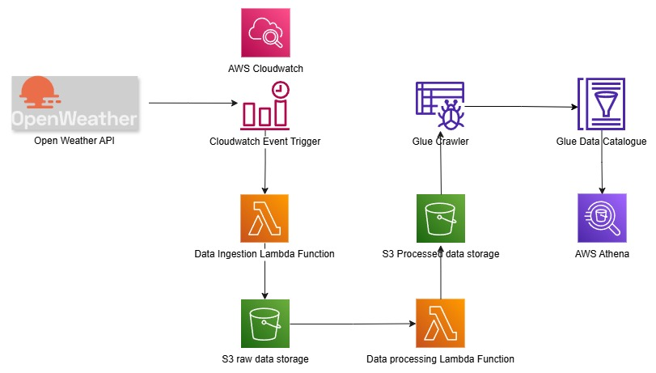

OpenWeather End-to-End Data Engineering Pipeline (AWS)

A fully serverless ETL pipeline that extracts, transforms, catalogs, and queries live weather data using AWS.
It pulls current weather + 5-day forecasts from the OpenWeather API and makes them queryable with Athena SQL.

🗺️ Architecture

🧩 Components (as built)

EventBridge (CloudWatch Schedule)
Triggers the extract Lambda on a schedule.

Lambda (Extract) — weather_api_data_extract
Calls OpenWeather API (Python) → writes raw JSON to S3 /raw/.

S3 Event Trigger
On new object under /raw/, triggers transform Lambda.

Lambda (Transform + Load) — weather_transformation_load_function
Parses/cleans raw JSON → writes partitioned output to S3 /processed/.

AWS Glue Crawler
Crawls s3://<bucket>/processed/ → builds Data Catalog tables.

AWS Athena
Run SQL on the processed tables for analysis (current + 5-day forecast).

🧰 Tech Stack

AWS: Jupyter, Lambda, EventBridge (CloudWatch), S3, Glue (Crawler + Data Catalog), Athena
Language: Python
Source: OpenWeather REST API

📂 Source Files (this repo)

Ingestion.py — code from weather_api_data_extract
Transform.py — code from weather_transformation_load_function
Architecture.jpg — pipeline diagram

📓 Notebook

my_weather_api_ETL.ipynb — Local Jupyter Notebook for testing the OpenWeather API.

Note: API key is not included for security. Use an environment variable OPENWEATHER_API_KEY when running locally.